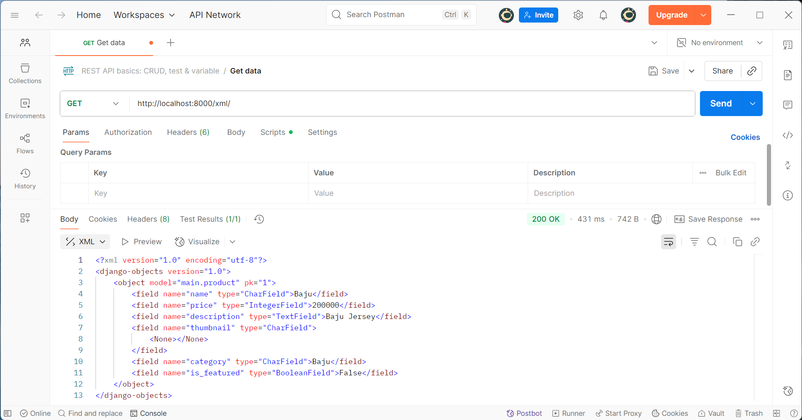
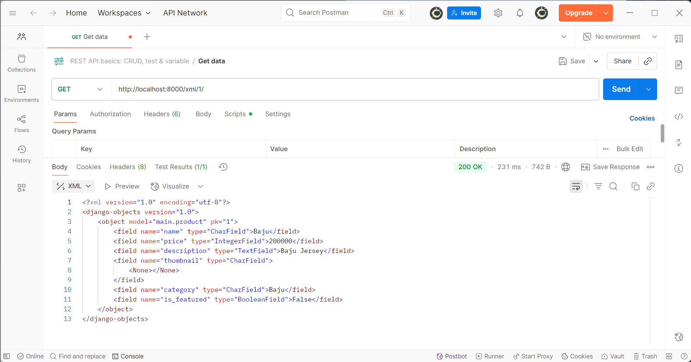
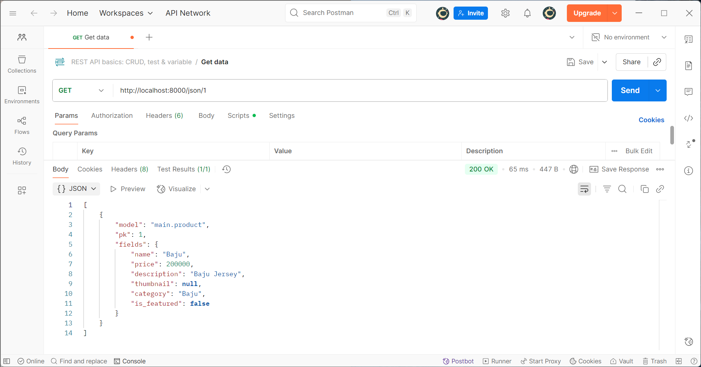

Tugas 2
1. Jelaskan bagaimana cara kamu mengimplementasikan checklist di atas secara step-by-step (bukan hanya sekadar mengikuti tutorial).
Pertama, membuat sebuah proyek Django baru dengan menjalankan perintah django-admin startproject football_shop . lalu menjalankan server.
Kedua, membuat aplikasi dengan nama main pada proyek tersebut dengan menjalankan perintah python manage.py startapp main. Direktori main akan berisi struktur awal untuk aplikasi Django. Lalu, mendaftarkan aplikasi main ke dalam proyek dengan cara menambahkan 'main' pada INSTALLED_APPS.
Ketiga, membuat dan mengisi berkas main.html sesuai dengan yang ingin ditampilkan yaitu nama aplikasi, nama, npm, dan kelas.
Keempat, membuat model pada aplikasi main dengan nama Product dan menambahkan atribut-atribut (name, price, description, thumbnail, category, dan is_featured).
Kelima, membuat fungsi show_main pada views.py untuk dikembalikan ke dalam template HTML yaitu main.html yang menampilkan nama aplikasi, nama, npm, dan kelas.
Keenam, melakukan sebuah routing pada urls.py aplikasi main untuk memetakan fungsi yang telah dibuat pada views.py dengan cara menjalankan perintah berikut.
from django.urls import path
from main.views import show_main
app_name = 'main'
urlpatterns = [
    path('', show_main, name='show_main'),
]
di mana terdapat satu route '' yang akan memanggil view show_main. Kemudian melengkapi rute URL ke aplikasi main dengan menambahkan urls.py pada level proyek agar proyek dapat melakukan pemetaan ke rute URL pada aplikasi main.
Ketujuh, simpan semua perubahan ke GitHub dan PWS dengan melakukan add, commit, dan push.

2. Buatlah bagan yang berisi request client ke web aplikasi berbasis Django beserta responnya dan jelaskan pada bagan tersebut kaitan antara urls.py, views.py, models.py, dan berkas html.

3. Jelaskan peran settings.py dalam proyek Django!
settings.py berperan sebagai pusat konfigurasi yang mengatur bagaimana aplikasi berjalan. Settings.py menentukan aplikasi apa yang digunakan (INSTALLED_APPS), mengatur database, mengatur lokasi file, dan mengatur keamanan (ALLOWED_HOSTS dan lain-lain).

4. Bagaimana cara kerja migrasi database di Django?
Migrasi adalah cara Django melacak perubahan pada model basis data. Pertama jalankan perintah python manage.py makemigrations untuk menciptakan berkas migrasi yang berisi perubahan model yang belum diaplikasikan ke dalam basis data. Lalu, jalankan perintah python manage.py migrate untuk mengaplikasikan perubahan model yang tercantum dalam berkas migrasi ke basis data.

5. Menurut Anda, dari semua framework yang ada, mengapa framework Django dijadikan permulaan pembelajaran pengembangan perangkat lunak?
Karena Django memiliki struktur yang jelas, memiliki banyak fitur bawaan yang sudah siap pakai, efisien dan hemat biaya, serta memiliki keamanan yang baik.

6. Apakah ada feedback untuk asisten dosen tutorial 1 yang telah kamu kerjakan sebelumnya?
Tidak ada

Tugas 3
1. Jelaskan mengapa kita memerlukan data delivery dalam pengimplementasian sebuah platform?
Data delivery diperlukan dalam pengimplementasian sebuah platform untuk memindahkan dan mendistribusikan data secara efisien, serta memungkinkan analisis data yang akurat sebab dalam mengembangkan suatu platform, ada saat di mana kita perlu mengirimkan data dari satu stack ke stack lainnya.

2. Menurutmu, mana yang lebih baik antara XML dan JSON? Mengapa JSON lebih populer dibandingkan XML?
Menurut saya, JSON lebih sesuai untuk API web modern. JSON lebih populer dibandingkan XML karena JSON lebih mudah dibaca dan dimengerti di mana setiap elemennya mendeskripsikan dirinya sendiri atau self describing. Selain itu, meskipun sintaks JSON berasal dari objek JavaScript, JSON sebenarnya adalah format text.

3. Jelaskan fungsi dari method is_valid() pada form Django dan mengapa kita membutuhkan method tersebut?
Method is_valid() pada form Django berfungsi untuk memvalidasi data formulir sehingga mencegah kesalahan data dan menjaga keamanan dalam aplikasi web.

4. Mengapa kita membutuhkan csrf_token saat membuat form di Django? Apa yang dapat terjadi jika kita tidak menambahkan csrf_token pada form Django? Bagaimana hal tersebut dapat dimanfaatkan oleh penyerang?
csrf_token adalah token unik yang dibuat server untuk setiap sesi pengguna dan disertakan dalam formulir, lalu server akan memverifikasi token tersebut saat terdapat request untuk memastikan request tersebut berasal dari pengguna yang sah. csrf_token dibutuhkan saat membuat form di Django untuk melindungi dari serangan CSRF, yaitu serangan keamanan yang memanfaatkan authenticated cookie korban untuk melakukan aksi tidak sah dari situs lain. Jika kita tidak menambahkan csrf_token pada form Django, Django akan menolak request, tetapi jika proteksi csrf juga dinonaktifkan, Django dapat menerima request tanpa mengecek token. Hal ini dapat dimanfaatkan oleh penyerang dengan cara mengirim form tidak sah menggunakan cookie korban.

5. Jelaskan bagaimana cara kamu mengimplementasikan checklist di atas secara step-by-step (bukan hanya sekadar mengikuti tutorial).
Pertama, membuat suatu skeleton sebagai kerangka views.
Kedua, membuat form untuk menginput dan menampilkan data Football Shop pada aplikasi yaitu dengan menambahkan file forms.py pada folder main. Kemudian, menambahkan file views.py pada folder main dan menambahkan fungsi show_main(), create_product(), dan show_product(). Lalu, menambahkan path url pada urls.py.
Ketiga, menambahkan tombol "Add" yang akan redirect ke halaman form. Lalu, menambahkan file create_product.html yang menampilkan halaman form input dan file product_detail.html yang menampilkan detail dari suatu produk.
Keempat, mengembalikan data dalam bentuk XML yaitu dengan menambahkan fungsi show_xml pada views.py lalu menambahkan path url pada urls.py.
Kelima, mengembalikan data dalam bentuk JSON yaitu dengan menambahkan fungsi show_json pada views.py lalu menambahkan path url pada urls.py.
Keenam, mengembalikan data berdasarkan id dalam bentuk XML yaitu dengan menambahkan fungsi show_xml_by_id pada views.py lalu menambahkan path url pada urls.py.
Ketujuh, mengembalikan data berdasarkan id dalam bentuk JSON yaitu dengan menambahkan fungsi show_json_by_id pada views.py lalu menambahkan path url pada urls.py.

6. Apakah ada feedback untuk asdos di tutorial 2 yang sudah kalian kerjakan?
Tidak ada

Screenshot Postman:

