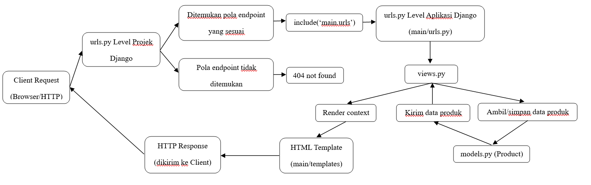

1. Jelaskan bagaimana cara kamu mengimplementasikan checklist di atas secara step-by-step (bukan hanya sekadar mengikuti tutorial).
Pertama, membuat sebuah proyek Django baru dengan menjalankan perintah django-admin startproject football_shop . lalu menjalankan server.
Kedua, membuat aplikasi dengan nama main pada proyek tersebut dengan menjalankan perintah python manage.py startapp main. Direktori main akan berisi struktur awal untuk aplikasi Django. Lalu, mendaftarkan aplikasi main ke dalam proyek dengan cara menambahkan 'main' pada INSTALLED_APPS.
Ketiga, membuat dan mengisi berkas main.html sesuai dengan yang ingin ditampilkan yaitu nama aplikasi, nama, npm, dan kelas.
Keempat, membuat model pada aplikasi main dengan nama Product dan menambahkan atribut-atribut (name, price, description, thumbnail, category, dan is_featured).
Kelima, membuat fungsi show_main pada views.py untuk dikembalikan ke dalam template HTML yaitu main.html yang menampilkan nama aplikasi, nama, npm, dan kelas.
Keenam, melakukan sebuah routing pada urls.py aplikasi main untuk memetakan fungsi yang telah dibuat pada views.py dengan cara menjalankan perintah berikut.
from django.urls import path
from main.views import show_main
app_name = 'main'
urlpatterns = [
    path('', show_main, name='show_main'),
]
di mana terdapat satu route '' yang akan memanggil view show_main. Kemudian melengkapi rute URL ke aplikasi main dengan menambahkan urls.py pada level proyek agar proyek dapat melakukan pemetaan ke rute URL pada aplikasi main.
Ketujuh, simpan semua perubahan ke GitHub dan PWS dengan melakukan add, commit, dan push.

2. Buatlah bagan yang berisi request client ke web aplikasi berbasis Django beserta responnya dan jelaskan pada bagan tersebut kaitan antara urls.py, views.py, models.py, dan berkas html.

3. Jelaskan peran settings.py dalam proyek Django!
settings.py berperan sebagai pusat konfigurasi yang mengatur bagaimana aplikasi berjalan. Settings.py menentukan aplikasi apa yang digunakan (INSTALLED_APPS), mengatur database, mengatur lokasi file, dan mengatur keamanan (ALLOWED_HOSTS dan lain-lain).

4. Bagaimana cara kerja migrasi database di Django?
Migrasi adalah cara Django melacak perubahan pada model basis data. Pertama jalankan perintah python manage.py makemigrations untuk menciptakan berkas migrasi yang berisi perubahan model yang belum diaplikasikan ke dalam basis data. Lalu, jalankan perintah python manage.py migrate untuk mengaplikasikan perubahan model yang tercantum dalam berkas migrasi ke basis data.

5. Menurut Anda, dari semua framework yang ada, mengapa framework Django dijadikan permulaan pembelajaran pengembangan perangkat lunak?
Karena Django memiliki struktur yang jelas, memiliki banyak fitur bawaan yang sudah siap pakai, efisien dan hemat biaya, serta memiliki keamanan yang baik.

6. Apakah ada feedback untuk asisten dosen tutorial 1 yang telah kamu kerjakan sebelumnya?
Tidak ada